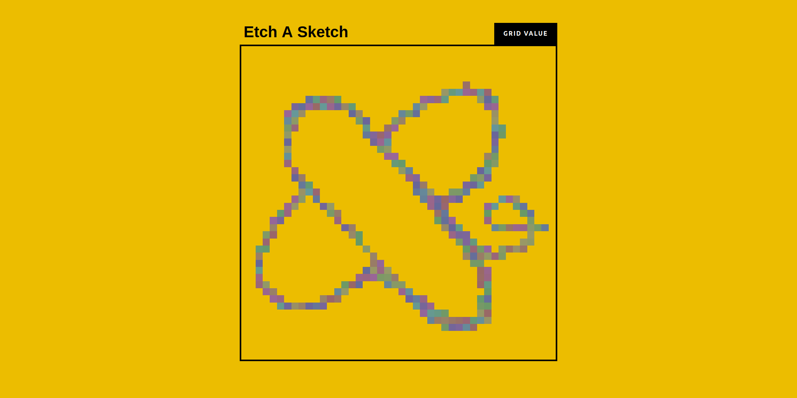

# Odin-Project-Etch-a-Sketck
Etch-a-Sketch project focused on basic Javascript methods and DOM manipulations.

Etch A Sketch Web App

A modern browser-based Etch A Sketch that dynamically creates a responsive drawing grid.
Features include:

Adjustable grid size with perfect fit inside the container

Color change on hover for interactive drawing

Responsive design using Flexbox

Elegant corporate-style footer

Built with HTML, CSS, and JavaScript.
